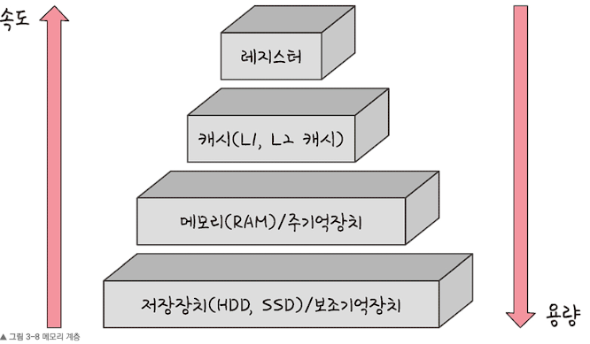
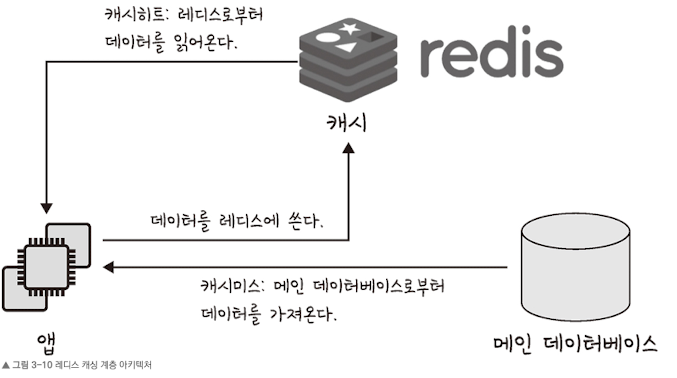
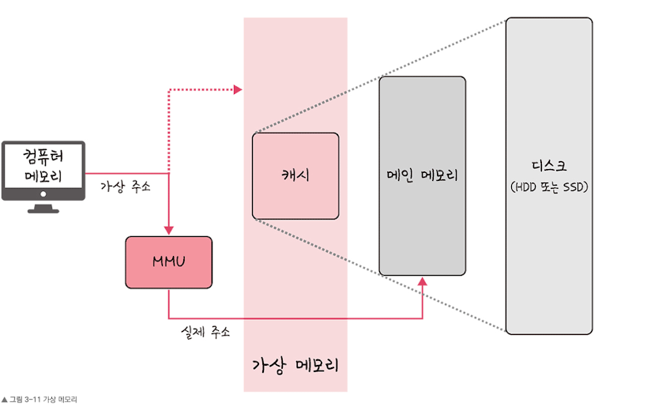
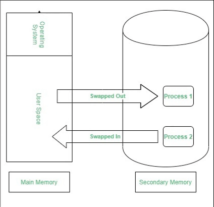
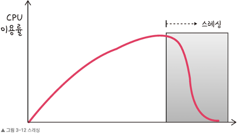
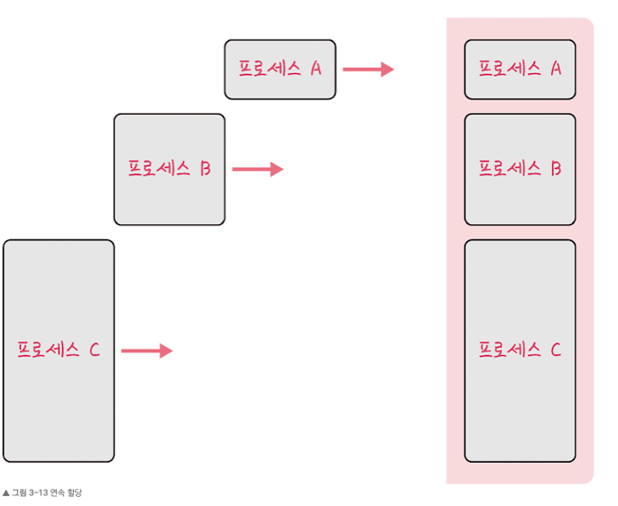

## 3.2 메모리

## 1. 메모리 계층

메모리 게층은 레지스터, 캐시, 메모리, 저장장치로 구성되어 있습니다.

- **레지스터**: CPU 안에 있는 작은 메모리, 휘발성, 속도 가장 빠름, 기억 용량이 가장 적습니다.
- **캐시**: L1, L2 캐시를 지칭합니다. 휘발성, 속도 빠름, 기억 용량이 적습니다. 참고로 L3캐시도 있습니다.
- **주기억장치**: RAM을 가리킵니다. 휘발성, 속도 보통, 기억 용량이 보통입니다.
- **보조** **기억 장치**: HDD, SDD를 일컬으며 비휘발성, 속도 낮음, 기억 용량이 많습니다.

## 캐시

캐시는 데이터를 미리 복사해놓는 임시 저장소이자 빠른 장치와 느린 장치에서 속도차이에 따른 병목 현상을 줄이기 위한 메모리를 말합니다.

- 캐시계층 : 계층과 계층 사이에 잇는 계층을 캐시 계층이라고 합니다.

### 지역성의 원리

캐시를 직접 설정할 떄 는 자주 사용하는 데이터를 기반으로 설정해야합니다. 이때 자주 사용하는 데이터에 대한 근거가 되는 것이 바로 지역성 입니다.

- 지역성은 **시간 지역성**과 **공간 지역성**으로 나뉩니다.
    - **시간 지역성**: 최근 사용한 데이터에 다시 접근하려는 특성을 말합니다.
    - **공간 지역성**: 최근 접근한 데이터를 이루고 있는 공간이나 그 가까운 공간에 접근하는 특성을 말합니다.

### 캐시히트와 캐시미스

**캐시히트** : 캐시에서 원하는 데이터를 찾는 것.

**캐시미스** : 해당 데이터가 캐시에 없어서 주 메모리로 가서 데이터를 찾아오는 것.

### 웹 브라우저의 캐시

- 쿠키
    - 쿠키는 만료기한이 있는 키-값 저장소입니다.
    - same site 옵션을 strict로 설정하지 않았을 경우 다른 도메인에서 요청 했을 때 자동 전송됩니다.
    - 4KB까지 데이터를 저장할 수 있고 만료기한을 정할 수 있습니다.
    - 쿠키를 설정할 때는 document.cookie로 쿠키를 볼 수 없게 httponly옵션을 거는 것이 중요하며, 클라이언트 또는 서버에서 만료기한 등을 정할 수 있는데 보통 서버에서 만료기한을 정합니다.
- 로컬 스토리지
    - 로컬 스토리지는 만료기한이 없는 키-값 저장소입니다.
    - 10MB까지 저장할 수 있으며 웹 브라우저를 닫아도 유지되고 도메인 단위로 저장, 생성됩니다.
    - HTML5를 지원하지 않는 웹 브라우저에서는 사용할 수 없으며 클라이언트에서만 수정가능합니다.
- 세션 스토리지
    - 세션 스토리지는 만료기한이 없는 키-값 저장소입니다.
    - 탭 단위로 세션 스토리지를 생성하며, 탭을 닫을 때 해당 데이터가 삭제됩니다. 5MB까지 저장이 가능합니다.
    - HTML5를 지원하지 않는 웹 브라우저에서는 사용할 수 없으며 클라이언트에서만 수정가능합니다.

### 데이터베이스의 캐싱 계층

데이터 베이스 시스템을 구축할 떄도 메인 데이터베이스 위에 레디스(redis) 데이터 베이스 계층을 ‘캐싱 계층’으로 둬서 성능을 향상시키기도 합니다.

## 2. 메모리 관리

운영체제의 대표적인 할 일 중 하나가 메모리 관리입니다.

## 가상 메모리

**가상 메모리**(virtual memory)는 메모리 관리 기법의 하나로 컴퓨터가 실제로 이용 가능한 메모리 자원을 추상화하여 이를 사용하는 사용자들에게 매우 큰 메모리로 보이게 만드는 것을 말합니다.

이 때 가상적으로 주어진 주소를 **가상주소**(logical address),

실제 메모리상에 있는 주소를 **실제주소**(physical address)라고 합니다.

가상주소는 메모리관리장치(MMU)에 의해 실제 주소로 변환되며, 이 덕분에 사용자는 실제 주소를 의식할 필요없이 프로그램을 구축할 수 있습니다.

- 가상 메모리는 가상 주소와 실제 주소가 매핑되어 있고 프로세스의 주소 정보가 들어있는 ‘페이지 테이블’로 관리 됩니다. 이때 속도 향상을 위해 TLB를 씁니다.

  > **TLB**
  메모리와 CPU사이에 있는 주소 변환을 위한 캐시이다. 페이지 테이블에 있는 리스트를 보관하며 CPU가 페이지 테이블까지 가지 않도록 해 속도를 향상 시킬 수 있는 캐시 계층이다.

### 스와핑

만약 가상 메모리에는 존재하지만 실제 메모리인RAM에는 현재 없는 데이터나 코드에 접근할 경우 **페이지 폴트**가 발생합니다.

이 떄 메모리에서 당장 사용하지 않은 영역을 하드디스크로 옮기고 하드디스크의 일부분을 “마치 메모리처럼” 불러와 쓰는 것을 **스와핑(swaping)**이라고 합니다. 이를 통해 마치” 페이지 폴트가 일어나지 않은 것처럼” 만듭니다.

### 페이지 폴트

**페이지 폴트(page falut)란** 프로세스의 주소 공간에는 존재하지만 지금 이 컴퓨터의 RAM에는 없는 데이터를 접근했을 경우에 발생합니다.

페이지 폴트와 그로 인한 스와핑은 다음 과정으로 이루어집니다.

1. CPU는 물리 메모리를 확인하여 해당 페이지가 없으면 트랩을 발생해서 운영체제에 알립니다.
2. 운영체제는 CPU의 동작을 잠시 멈춥니다.
3. 운영체제는 페이지 테이블을 확인하여 가상 메모리에 페이지가 존재하는지 확인하고, 없으면 프로세스를 중단하고 현재 물리 메모리에 비어 있는 프레임이 있는지 찾습니다. 물리 메모리에도 없다면 스와핑이 발동됩니다.
4. 비어 있는 프레임에 해당 페이지를 로드하고, 페이지 테이블을 최신화합니다.
5. 중단되었던 CPU를 다시 시작합니다.

**페이지(page)**
가상 메모리를 사용하는 최소 크기 단위

**프레임(frame)**
실제 메모리를 사용하는 최소 크기 단위

### 스레싱

**스레싱(thrashing)은** 메모리의 페이지 폴트율이 높은 것을 의미하며, 이는 컴퓨터의 심각한 성능 저하를 초래합니다.

스레싱은 메모리에 너무 많은 프로세스가 동시에 올라가게 되면 스와핑이 많이 일어나서 발생하는 것입니다.

페이지 폴트가 일어나면 CPU 이용률이 낮아집니다. CPU 이용률이 낮아지게 되면 운영체제는 “CPU가 한가한가?” 라고 생각하여 가용성을 더 높이기 위해 더 많은 프로세스를 메모리에 올리게 됩니다. 이와 같은 악순환이 반복되며 스레싱이 일어나게 됩니다.

**해결방법**

1. 메모리를 늘린다.
2. HDD를 사용한다면 SSD로 바꾼다.
3. 운영체제에서 해결한다.
    1. 작업세트
        - 프로세스의 과거 사용 이력인 지역성을 통해 결정된 페이지 집합을 만들어서 미리 메모리에 로드하는 것입니다.
        - 미리 메모리에 로드하면 탐색에 드는 비용을 줄일 수 있고 스와핑 또한 줄일 수 있습니다.
    2. PFF
        - 페이지 폴트 빈도를 조절하는 방법으로 상한선과 하한선을 만드는 방법입니다.
        - 만약 상한선에 도달한다면 프레임을 늘리고 하한선에 도달한다면 프레임을 줄이는 것입니다.

## 메모리 할당

메모리에 프로그램을 할당할 때는 시작 메모리 위치, 메모리의 할당 크기를 기반으로 할당하는데, 연속 할**당**과 **불연속 할당**으로 나뉩니다.

### **연속 할당**

연속 할당은 메모리에 ‘연속적으로’ 공간을 할당하는 것을 말합니다.

그림처럼 순차적으로 공간에 할당하는 것을 볼 수있습니다. 이는 고정 분할 방식과 가변 분할 방식이 있습니다.

**고정분할 방식**

메모리를 미리 나누어 관리하는 방식입니다.

- 메모리가 미리 나뉘어 있기 때문에 융통성이 없습니다.
- 내부 단편화가 발생합니다.

**가변 분할 방식**

매 시점 프로그램의 크기에 맞게 동적으로 메모리를 나눠 사용합니다.

- 내부 단펴화는 생기지 않고 외부 단편화는 발생할 수 있습니다.
- 이는 최초적합, 최적접합, 최악접합이 있습니다.

> **내부 단편화**
메모리를 나눈 크기보다 프로그램이 작아서 들어가지 못하는 공간이 많이 발생하는 현상

**외부 단편화**
메모리를 나눈 크기보다 프로그램이 커서 들어가지 못하는 공간이 많이 발생하는 현상

### 불 연속 할당

메모리를 연속적으로 할당하지 않는 불연속 할당은 현대 운영체제가 쓰는 방법으로 불연속 할당인 페이징 기법이 있습니다. 이외에도 세크멘테이션,페이지드 세그멘테이션이 있습니다.

**페이징**

페이징은 동일한 크기의 페이지 단위로 나누어 메모리의 서로 다른 위치에 프로세스를 할당합니다.

- 홀의 크기가 균일하지 않은 문제가 없어지지만 주소 변환이 복잡해집니다.

**세그멘테이션**

세그멘테이션은 페이지 단위가 아닌 의미 단위인 세그먼트로 나누는 방식입니다.

**페이지드 세그멘테이션**

페이지드 세그멘테이션은 프로그램을 의미 단위인 세그먼트로 나눠 공유나 보안 측면에 강점을 두고 임의의 길이가 아닌 동일한 크기의 페이지 단위로 나누는 것을 말합니다.