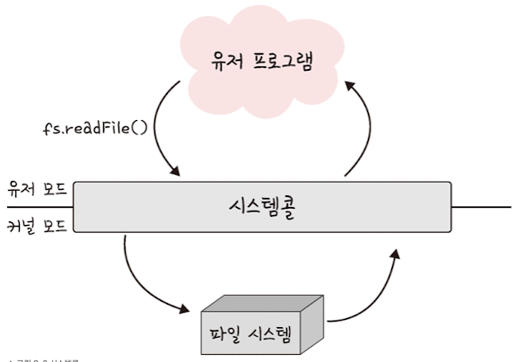
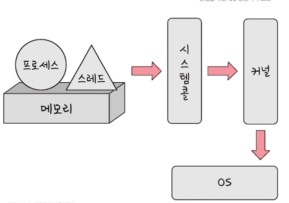
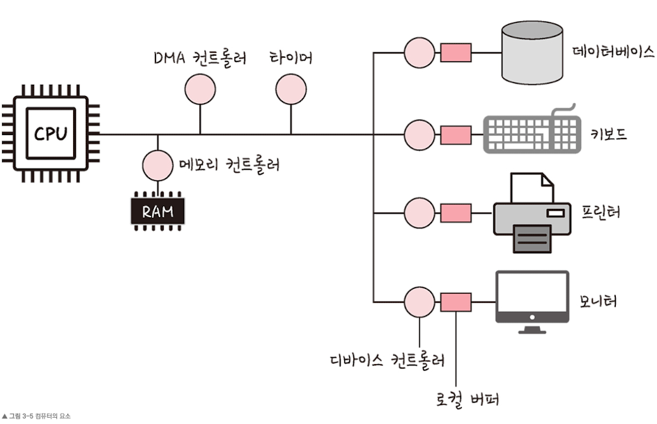
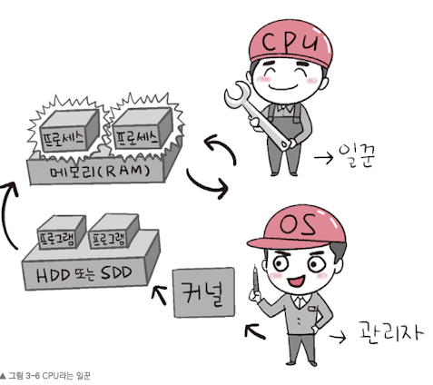
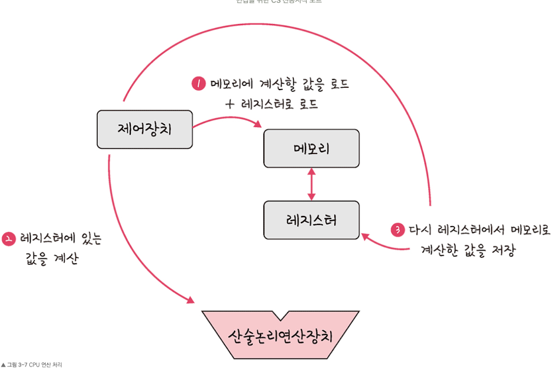

## 3.1 운영체제와 컴퓨터

## 1. 운영체제의 역할과 구조

### 운영체제의 역할

1. **CPU스케줄링과 프로세스 관리 :** CPU 소유권을 어떤 프로세스에 할당할지, 프로세스의 생성과 삭제, 자원 할당 및 반환을 관리합니다.
2. **메모리 관리:** 한정된 메모리를 어떤 프로세스에 할당해야 하는지 관리합니다.
3. **디스크 파일 관리:**  디스크 파일을 어떠한 방법으로 보관할지 관리합니다
4. **I/O디바이스 관리:** I/O 디바이스들인 마우스, 키보드와 컴퓨터 간에 데이터를 주고받는 것을 관리합니다.

### 운영체제의 구조

유저 프로그램이 맨위에 있고 그다음이 GUI, 시스템콜, 커널, 드라이버가 있으며 가장 밑에 하드웨어가 있는 구조입니다.

- 여기서 GUI,시스템콜,커널, 드라이버를 운영체제라고 지칭합니다.

### **시스템콜**

- 시스템 콜이란 **운영체제가 커널에 접근하기 위한 인터페이스**이며 유저 프로그램이 운영체제의 서비스를 받기 위해 커널 함수를 호출할 때 씁니다.
- 시스템 콜을 통해 컴퓨터 자원에 대한 **직접 접근을 차단**할 수 있고 프로그램을 다른 프로그램으로부터 보호할 수 있습니다.
- 커널이란 운영체제의 핵심 부분이자 시스템 콜을 제공하며 보안, 메모리, 프로세스,파일 시스템,I/O 디바이스, I/O요청 관리 등 운영체제의 중추적인 역할을 합니다.
1. 유저 프로그램이 I/O 요청 트랩발동
2. 올바른 I/O 요청인지 확인한 후
3. 유저 모드가 시스템콜을 통해
4. 커널 모드로 변환한 후 커널함수를 실행합니다.

   

- 시스템 콜은 하나의 추상화 계층이기 때문에 네트워크 통신이나 데이터베이스와 같은 낮은 단계의 영역 처리에 대한 부분을 많이 신경 쓰지 않고 프로그램을 구현할 수 있는 장점이 있습니다.

  

**modebit**

시스템 콜이 작동될떄 modebit을 참고해서 유저 모드와 커널 모드를 구분합니다.

- 1 또는 0을 가지는 **플래그 변수**입니다.
- 0은 커널 모드, 1은 유저모드라고 설정됩니다.

## 2. 컴퓨터의 요소

컴퓨터는 **CPU, DMA 컨트롤러, 메모리, 타이머, 디바이스 컨트롤러** 등으로 이루어져 있습니다.

## CPU

CPU(Central Processing Unit)는 **산술논리연산장치**, **제어장치**, **레지스터**로 구성되어 있는 컴퓨터 장치를 말하며, 인터럽트에 의해 단순히 메모리에 존재하는 명렬어를 해석하는 일꾼입니다.

- 관리자 역할을 하는 운영체제의 커널이 프로그램을 메모리에 올려 프로세스로 만들면 일꾼인 CPU가 이를 처리합니다.
- **제어장치**(**CU** Control Unit) : 프로세스 조작을 지시하는 CPU의 한 부품입니다.
    - 입출력장치 간 통신을 제어하고 명령어들을 읽고 해석하며 데이터 처리를 위한 순서를 결정합니다.
- ******************레지스터 :****************** CPU안에 있는 ************************************매우 빠른 임시 기억장치를 가리킵니다.
    - CPU와 직접 연결되어 있으므로 연산 속도가 메모리보다 수십 배에서 수백 배 까지 빠릅니다.
    - CPU는 자체적으로 데이터를 저장할 방법이 없기 때문에 레지스터를 거쳐 데이터를 전달합니다.
- **********************************산술논리연산장치**********************************(ALU, Arthmetic Logic Unit) : 덧셈, 뻴셈 같은 두 숫자의 산술 연산과 베타적 논리합, 논리곱 같은 논리 연산을 계산하는 디지털 회로입니다.

### CPU의 연산처리

1. 제어장치가 메모리에 계산할 값을 로드합니다. 또한 레지스터에도 로드합니다.
2. 제어장치가 레지스터에 있는 값을 계산하라고 산술논리연산장치에 명령합니다.
3. 제어장치가 계산된 값을 다시 ‘레지스터에서 메모리로’ 계산한 값을 지정합니다.

- **인터럽트 :** 어떤 신호가 들어왔을 때 CPU를 잠깐 **정지시키는** 것을 말합니다.
    - IO디바이스로 인한 인터럽트, 0으로 숫자를 나눈는 산술 연산에서의 인터럽트, 프로세스 오류등으로 발생합니다.
    - 발생되면 인터럽트 핸들러 함수가 모여있는 인터럽트 벡터로 가서 인터럽트 핸들러 함수가 실행됩니다.
    - 인터럽트 간에는 우선순위가 있고 우선순위에 따라 실행됩니다.
    - 인터럽트는 하드웨어 인터럽트, 소프트웨어 인터럽트로 나뉩니다.
        - **하드웨어 인터럽트** : IO 디바이스에서 발생하는 인터럽트를 말합니다.
        - **소프트웨어 인터럽트** : 프로세스 오류등으로 프로세스가 시스템콜을 호출할 때 발동합니다.

## DMA 컨트롤러

DMA 컨트롤러는 I/O디바이스가 메모리에 직접 접근할 수 있도록 하는 하드웨어 장치를 뜻합니다.

- CPU 부하를 막아주며 CPU의 일을 부담하는 **보조일꾼**이라고 보면 됩니다.
- 하나의 작업을 CPU와 DMA컨트롤러가 동시에 하는 것을 방지합니다.

## 메모리

**메모리는** 전자회로에서 데이터나 상태 등을 기록하는 장치를 말합니다. 보통 RAM(Random Acess Memory)을 일컬어 메모리라고도 합니다.

## 타이머

**타이머는** 몇 초안에 작업이 끝나야 한다는 특정 프로그램에 시간 제한을 다는 역할을 합니다. 시간이 많이 걸리는 프로그램이 작동할 때 제한을 걸기 위해 존재합니다.

## 디바이스 컨트롤러

**디바이스 컨트롤러는** 컴퓨터와 연결되어 있는 IO 디바이스들의 작은 CPU를 말하고 옆에 붙어 있는 로컬 버퍼는 각 디바이스에서 데이터를 임시로 저장하기 위한 작은 메모리를 뜻합니다.